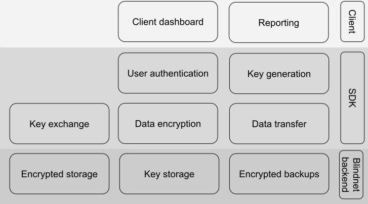
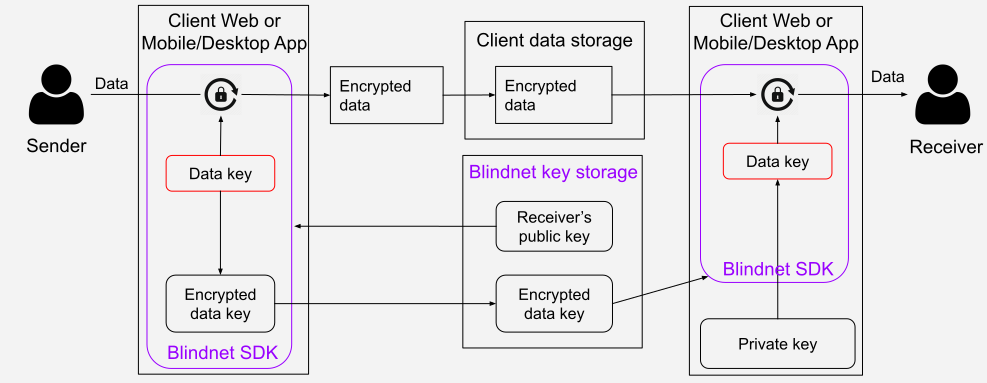

# How it works

The figure below shows different components of blindnet.

    Blindnet components.

## Blindnet in web applications

To protect user data in your web application, blindnet provides an SDK for data encryption and decryption, and for managing encryption keys. 

    Blindnet in web and mixed applications.

Let’s call our receiver Alice and our sender Bob. With blindnet, if Bob wants to send data (e.g., a text message or a file) to Alice, the process is as follows:

- Bob inputs the data (e.g. a file) into the browser's interface
- The browser will use blindnet SDK to encrypt the data
- Encrypted data should then be transferred and stored on your app's server
- When Alice requests the data (or immediately after the data was stored), your app delivers the encrypted data to her
- The browser on Alice's device will use blindnet SDK to decrypt the data
- Alice views the original data that Bob sent to her

This workflow ensures that only Alice and Bob have access to the data. To be more precise, only Alice and Bob possess the encryption key used to encrypt the file.
While stored and in transfer, the file is encrypted and neither blindnet nor the app’s server are able to access it.

After the data is decrypted in Alice's browser, it can simply be saved on her device. The data stays encrypted on the app's server and Step 4 can be carried out multiple times.

In step 2. (The browser will use blindnet api to encrypt the message), blindnet api performs the following steps:

- Generates an ephemeral encryption key and encrypts the data
- Obtains Alice's public key and verifies it belongs to her
- Encrypts the ephemeral encryption key and saves it to the blinenet server
- Returns the encrypted data

In Step 4. (The browser on Alices's device will use blindnet api to decrypt the data), blindnet SDK performs the following steps:

- Obtains the encrypted ephemeral key from blindnet’s server
- Uses Alice's private key to decrypt they key
- Uses the decrypted key to decrypt the encrypted data
- Returns the original data

Blindnet supports use cases in which data senders can be both registered or unregistered users of your application. Data exhange between two registered users works in a way similar to the one described above, with a difference that teh symmetric key for encrypting the data from Bob to Alice is always the same, and it is securely stored on blindnet servers after it has been previously encrypted with Bob's and Alice's public keys.

## Blindnet in mobile/desktop only applications

Coming soon...

